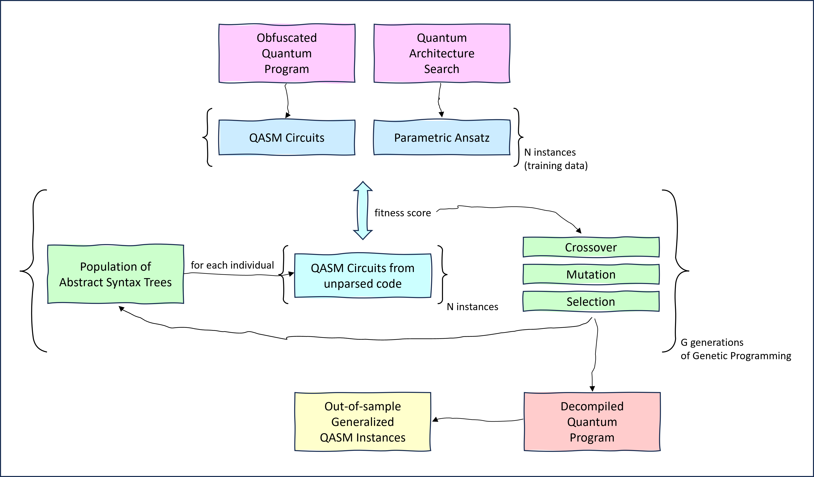

# DeQompile: Genetic Programming based QASM-to-Qiskit decompiler

### Quantum circuit decompilation using genetic programming towards explainable quantum architecture search

**Abstract:** Demonstrating quantum advantage using conventional quantum algorithms remains challenging on current noisy gate-based quantum computers. Automated quantum circuit synthesis via quantum machine learning has emerged as a promising solution, employing trainable parametric quantum circuits to alleviate this. The circuit ansatz in these solutions is often designed through reinforcement learning-based quantum architecture search (RL-QAS) when the domain knowledge of the problem and hardware are not effective. However, the interpretability of these synthesized circuits remains a significant bottleneck, limiting their scalability and applicability across diverse problem domains.

This work addresses the challenge of explainability in quantum architecture search (QAS) by introducing a novel genetic programming-based decompiler framework for reverse-engineering high-level quantum algorithms from low-level circuit representations. The proposed approach, implemented in the open-source tool, DeQompile, employs program synthesis techniques, including symbolic regression and abstract syntax tree manipulation, to distill interpretable Qiskit algorithms from quantum assembly language. Validation of benchmark algorithms demonstrates the efficacy of our tool. By integrating the decompiler with online learning frameworks, this research potentiates explainable QAS by fostering the development of generalizable and provable quantum algorithms.



### Quantum Circuit Decompiler: Pattern Recognition of Quantum Circuits By Genetic Algorithm

This repository hosts the accompanying software for the following [master thesis](https://studenttheses.universiteitleiden.nl/handle/1887/4010640). 

**Abstract:** For gate-based quantum computing, the design of quantum circuits is a critical procedure for implementing specific quantum algorithms. Currently, many quantum circuits are designed using Quantum Architecture Search, where heuristic algorithms are often applied, resulting in circuits that are not human-interpretable. To understand the underlying logic and specific patterns of the quantum circuits, we have developed a QASM-to-Qiskit transformation called the quantum decompiler. This transformation acts as a form of reverse engineering, converting the relatively low-level representation of a quantum circuit – the QASM file into a more understandable, high-level representation, the Python Qiskit code. To implement this method, we combined Genetic Algorithms (GA) and Abstract Syntax Trees (AST). In our work, we primarily focus on developing the concept and testing this proof-of-concept on some simple, commonly used quantum circuits (GHZ, QFT, QPE) with a limited number of qubits. At the end of this research, the metrics used for the evaluation of the output of our decompiler is also discussed.

### Software

The Quantum Circuit Genetic Decompiler project provides a modular approach to evolving quantum circuits using genetic programming techniques. This project is split into 3 main components, each responsible for handling different aspects of the quantum circuit decompilation and optimization process.

- **dataset.py**: Manages the loading, preprocessing, and handling of quantum circuit datasets. This module ensures that data is formatted and ready for use in the decompilation process.
- **q_ast_gen.py**: Responsible for generating random quantum circuits. This module serves as the core for creating initial circuit conditions and potential solutions that the genetic programming can evolve.
- **deqompiler.py**: Contains the logic for the genetic algorithm, including mutation, crossover, and selection mechanisms tailored for optimizing quantum circuits. It is also the entry point of the application, orchestrating the flow between dataset management, circuit generation, and the decompilation process. It initializes the process, executes the genetic algorithm, and outputs the results.

### Citation:
If you find the repository useful, please consider citing:

```
@misc{deqompiler,
  author={Xie, Shubing and Sarkar, Aritra},
  title={DeQompiler: Genetic Programming based QASM-to-Qiskit decompiler},
  howpublished={\url{[https://github.com/Advanced-Research-Centre/DeQompile](https://github.com/Advanced-Research-Centre/DeQompile)}},
  year={2024}
}
```

